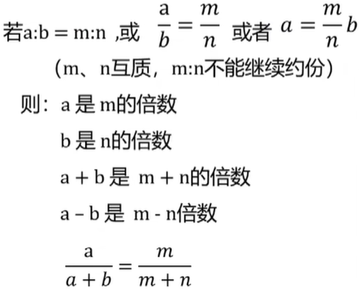

# 语言理解
# 数量关系

## 类型

- ~~数字推理~~

  > 大部分省份近些年未出现，国考偶尔会出

- 数学运算

## 01代入排除法

### 适用题型

1. 固定题型
   - 年龄问题
   - 余数问题
   - 多位数
   - 不定方程
2. 不会做的

### 方法技巧
直接将选择的答案填入题干中，然后根据题干进行推理。
## 02数字特性法
通常与01带入排除结合使用
### 奇偶特性
####  适用题型
1. 知和求差、知差求和
2. 2倍类、平均分
3. 不定方程
#### 方法特性
1. 和差
    - 偶±偶=偶
    - 偶±奇=奇
    - 奇±奇=偶
> 和差同性
2. 乘除
    - 偶×偶=偶
    - 偶×奇=偶
    - 奇×奇=奇
### 整除特性
#### 适用题型
判断余数
#### 方法特性
1. 一个数能被2(5)整除，看末一位能被2(5)整除
2. 一个属能被4(25)整除，看末两位能被4(25)整除
3. 一个数能被8(125)整除，看末三位能被8(125)整除
4. 一个数能被3(9)整除，看各个数字之和能被3(9)整除
### 倍数特性
#### 适用题型
倍数、百分比、分数、比例、分组
#### 方法特性
1. 普通倍数
2. 因子倍数
3. 比例倍数

仅对比例倍数进行说明：

## 方程法
### 适用题型

- 和差倍比
- 鸡兔同笼
- 盈亏问题
- 经济利润
- 行程问题

### 方法技巧
- 三条原则
  1. 优先设所求量
  2. 设小不设大
  3. 设中间变量

  
# 推理判断
# 资料分析
# 常识